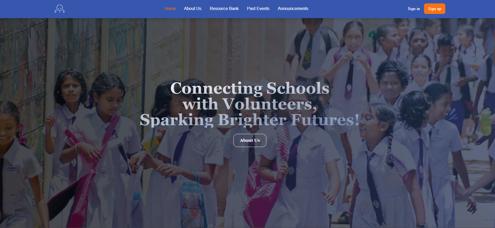

# LearnHeart



## 🚀 About LearnHeart

**LearnHeart** is the first schools and volunteering organizations collaboration platform in Sri Lanka, dedicated to bridging the educational gap in rural schools. Built with the **MERN stack**, LearnHeart connects rural schools with **volunteers and organizations**, facilitating seminar requests and fostering educational support.

> **"Build Connections With Your Peers and fellow graduates across the nation with LearnHeart"**

## 🌍 Project Vision

LearnHeart aligns with **United Nations Sustainable Development Goal 4** (Quality Education) by empowering underprivileged students with access to better learning opportunities.

## 🛠️ Tech Stack

- **Frontend:** React (Vite) + Tailwind CSS
- **Backend:** Node.js + Express.js
- **Database:** MongoDB (Mongoose)
- **Authentication:** Clerk
- **Machine Learning:** Python + Flask (LangChain Integration)
- **Deployment:** Vercel (Frontend) & Render (Backend)

## 🎯 Key Features

- 📌 **User Roles:** Schools, Volunteers, and Organizations with separate dashboards.
- 🎓 **Seminar Requests:** Schools can request seminars; organizations and volunteers can respond.
- 🔐 **Authentication:** Secure login/signup via Clerk.
- 📄 **Skill Verification:** Volunteers' CVs are processed to extract and evaluate skills.
- 📡 **Real-Time Chatbot:** AI-powered chatbot to assist users.

## 🔧 Installation & Setup

### Prerequisites
- Node.js (v18+)
- MongoDB (Cloud or Local)
- Python (for ML component)

### Backend Setup
```bash
cd backend
npm install
npm run dev
```

### Frontend Setup
```bash
cd frontend
npm install
npm run dev
```

## 🎥 Demo
[Watch Demo](https://youtu.be/ZPzg_8ERfw8)


## 📜 License
This project is licensed under the **MIT License**.

## 📞 Contact
- **Project By:** Team CodeNova
- **Email:** lashenmartino@gmail.com
- **Website:** [www.learnheart.live](https://learnheart-marketing.vercel.app)

---

_"Uplift and start learning/tutoring with LearnHeart!"_
